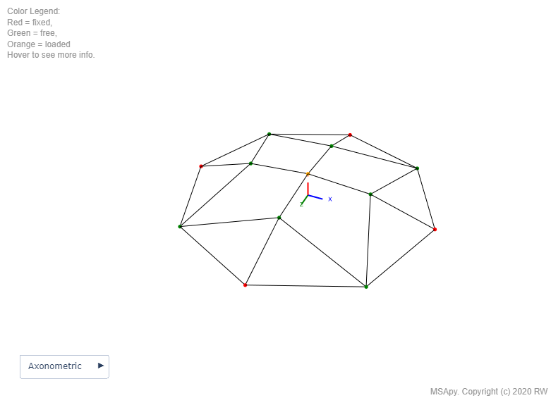
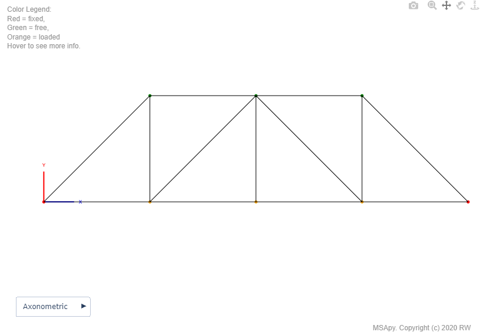
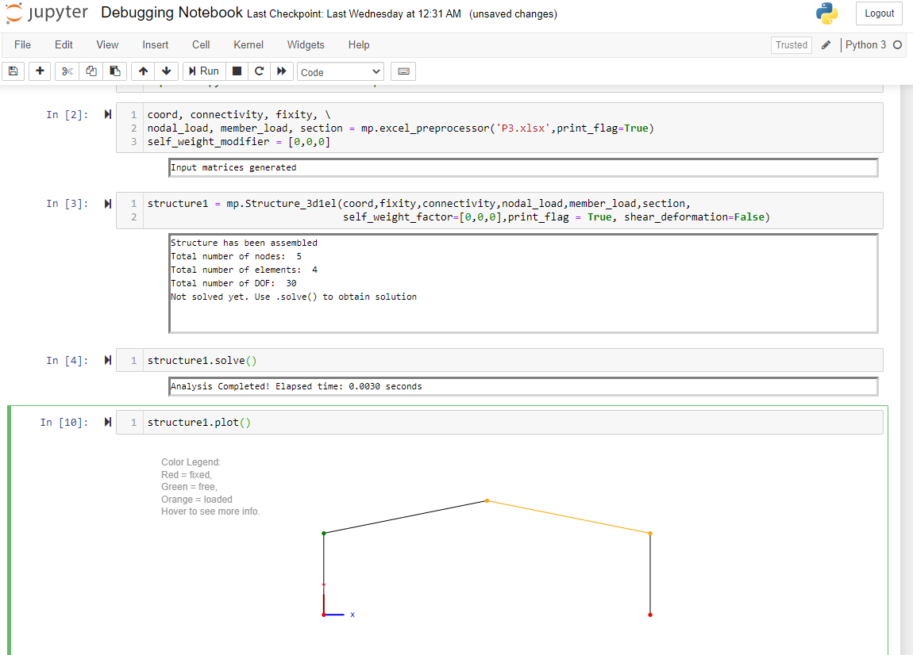
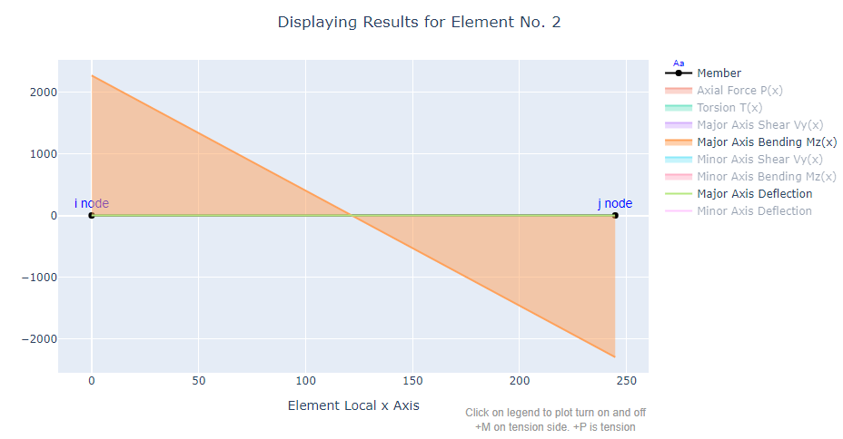
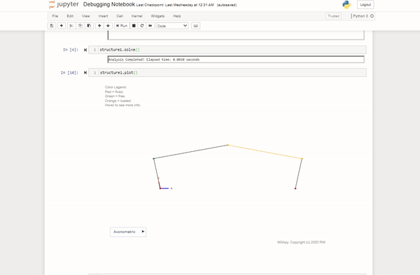

# MSApy - Matrix Structural Analysis in Python

MSApy is a free-to-use, open-source python package for matrix structural analysis. Perform quick analyses right in your Jupyter Notebook or IDE of your choice.

|   |     |
| ----------------------------------------------- | ----------------------------------------------- |
|  |  |

Full web-interactivity with Plotly!



<u>Notable Features:</u>


- [x] Easy to learn and use

- [x] Analysis of 2D and 3D beams, frames, and trusses

- [x] Nodal loads in any global direction

- [x] Member uniform load in three member local axis (w<sub>x</sub>, w<sub>y</sub>, w<sub>z</sub>)

- [x] Moment-released Member (pinned-fixed or pinned-pinned)

- [x] Member orientation rotation

- [x] Shear deformation

- [x] Support settlement

- [x] AISC W and HSS sections available

- [x] Beautiful visualization and web interactivity with Plotly.js

Planned in the future:

- [ ] Second-order elastic analysis (2-D and 3-D)
- [ ] Second-order inelastic analysis (2-D)
- [ ] Modal and eigen value analysis (2-D and 3-D)

<br>

## Table of Content
* [Quick Start Guide](#quick-start-guide)
* [Program Structure](#program-structure)
* [Input and Output Matrices](#input-and-output-matrices)
* [Notes and Assumptions](#notes-and-assumptions)
* [References](#references)
* [Copyright and License](#copyright-and-license)
* [Feedbacks](#feedbacks)

<br>

## Quick Start Guide

Make sure MSApy is in the same directory as your notebook. Import module:

```python
import msapy.firstorderelastic3D as mp
```

Use the provided user input spreadsheet to quickly initialize input matrices. Please note that the use of this spreadsheet is completely optional. Ultimately, 6 input matrices have to be specified (see "Input and Output Matrices" section below.)

```python
coord, connectivity, fixity, nodal_load, member_load, 
section = mp.excel_preprocessor('inputfile.xlsx', print_flag=True)
```

Initialize:

```python
self_weight_factor = [0,0,0]
print_flag = True
shear_deformation = False

structure1 = mp.Structure_3d1el(coord, fixity, 
                                connectivity, nodal_load, member_load, section,
                                self_weight_factor, print_flag, shear_deformation)
```

Solve:

```python
structure1.solve()
```

Visualize:

```python
structure1.plot()
structure1.plot_results()
structure1.plot_member_results(ele_number)
```

If using IDE like spyder or vscode, it may be necessary to change your default renderer

```python
import plotly.io as pio
pio.renderers.default = "browser"
```

Refer to the "verification_examples" folder for some sample input spreadsheets.

<br>

## Program Structure

MSApy has a highly intuitive object-oriented programming design. Data are encapsulated into three classes:

* Structure_suffix
  * Stores information related to the overall structure. For example, the number of degree-of-freedoms, DOF numbering, input matrices and final result matrices, structure stiffness matrices, etc.
  * It also contains two arrays: `.node_array` and `.element_array`. These arrays store the structure's node and element objects (described below)
* Element_suffix
  * Stores information related to the individual elements such as section properties, element stiffness matrices, fixed-end force vectors, length, etc.
* Node_suffix
  * Stores the (x, y, z) coordinate of each node

I've included a suffix for future expansion to include geometric and material non-linearities.

* _3d1el = 3-D first-order elastic analysis module

To see the methods and properties defined in each class, you can view the docstrings via python's help command.

```python
help(mp.Structure_3d1el)
help(mp.Element_3d1el)
help(mp.Node_3d1el)
```

<br>

## Input and Output Matrices


<br>

## Notes and Assumptions  

* MSApy is agnostic when it comes to unit. Stay consistent for valid results
* Global Coordinate (X, Y, Z): 
	* Y is the vertical axis (Elevation)
	* X and Z are the axes within the horizontal plane (Plan)
* Local Coordinate (x, y, z):
	* x-axis = element longitudinal axis
	* z-axis = major bending axis
	* y-axis = minor bending axis (along depth of element)
* The default member orientation (web direction vector) follows the following algorithm.
  1.  +x is defined by element start and end node
  2. If +x is aligned with +Y (vertical member), then +y is aligned with -X (i.e. <-1,0,0>)
  3. In other cases, +y will always have positive component with +Y
  4. After defining x and y, local z-axis is defined to be consistent with right-hand rule
  5. The element may be rotated by a user-specified beta angle.

<br>


## References 
I had to refer to my CEE 280 and CEE 282 course notes extensively during development (both taught by Prof. Deierlein at Stanford). The object-oriented design of MSApy; with 3 distinct classes (nodes, element, and structure) is also entirely based on the CEE 280 programming project. MSApy started off as a simple code conversion from MATLAB to Python. Later on, many additional features and refinements were added.

* Kassimali, A. (2012). Matrix analysis of structures. USA: Cengage Learning. 
* McGuire, W., Gallagher, R., Ziemian, R. (2014). Matrix Structural Analysis. Second Edition. 
* CEE 280 and CEE 282 Course note by Dr. Greg Deierlein
* CEE 281 course note by Dr. Ronaldo Borja

* CEE 421L course note by Dr. Henri Gavin. Link: http://people.duke.edu/~hpgavin/cee421/frame-finite-def.pdf
* OpenSeespy Visualization module by Seweryn Kokot: https://github.com/zhuminjie/OpenSeesPy/blob/master/openseespy-pip/openseespy/postprocessing/ops_vis.py

<br>

## Copyright and License

MIT License  
Copyright (c) [2020] [Robert Wang]

Permission is hereby granted, free of charge, to any person obtaining a copy
of this software and associated documentation files (the "Software"), to deal
in the Software without restriction, including without limitation the rights
to use, copy, modify, merge, publish, distribute, sublicense, and/or sell
copies of the Software, and to permit persons to whom the Software is
furnished to do so, subject to the following conditions:

The above copyright notice and this permission notice shall be included in all
copies or substantial portions of the Software.

THE SOFTWARE IS PROVIDED "AS IS", WITHOUT WARRANTY OF ANY KIND, EXPRESS OR
IMPLIED, INCLUDING BUT NOT LIMITED TO THE WARRANTIES OF MERCHANTABILITY,
FITNESS FOR A PARTICULAR PURPOSE AND NONINFRINGEMENT. IN NO EVENT SHALL THE
AUTHORS OR COPYRIGHT HOLDERS BE LIABLE FOR ANY CLAIM, DAMAGES OR OTHER
LIABILITY, WHETHER IN AN ACTION OF CONTRACT, TORT OR OTHERWISE, ARISING FROM,
OUT OF OR IN CONNECTION WITH THE SOFTWARE OR THE USE OR OTHER DEALINGS IN THE
SOFTWARE.

<br>

## Feedbacks

Thank you for using MSApy. Please note MSApy is a one-man project and can in no way, shape or form compete with the level of debugging process at commercial software companies. In using the program, the user accepts and understands that no warranty is expressed or implied by the developers on the accuracy or the reliability of the program. The user must explicitly understand the assumptions of the program and must independently verify the results.

Please forward your suggestions, feedbacks, criticisms, etc here on Github or send me an email at rwang01 [/\\] stanford edu. Thank you!


Robert

Last Updated: 2020-12-29

